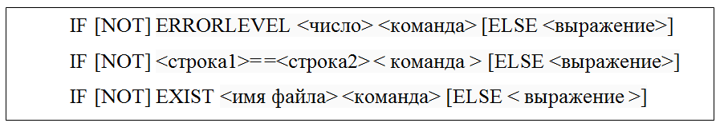
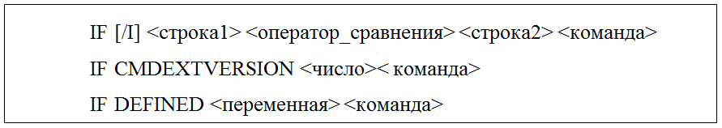

# УТИЛИТА IF КОМАНДНОЙ СТРОКИ CMD
## Техническое задание
# СОДЕРЖАНИЕ

[1. Введение](#1-введение)

[1.1. Наименование](#11-наименование)

[1.2. Краткая характеристика области применения](#12-краткая-характеристика-области-применения)

[2. Основания для разработки](#2-основания-для-разработки)

[2.1. Основание для проведения разработки](#21-основание-для-проведения-разработки)

[2.2. Наименование и условное обозначение темы разработки](#22-наименование-и-условное-обозначение-темы-разработки)

[3. Назначение разработки](#3-назначение-разработки)

[3.1. Функциональное назначение](#31-функциональное-назначение)

[3.2. Эксплуатационное назначение](#32-эксплуатационное-назначение)

[4. Требования к программе](#4-требования-к-программе)

[4.1. Требования к функциональным характеристикам](#41-требования-к-функциональным-характеристикам)

[4.1.1. Требования к составу выполняемых функций](#411-требования-к-составу-выполняемых-функций)

[4.1.2. Требования к организации входных и выходных данных](#412-требования-к-организации-входных-и-выходных-данных)

[4.1.3. Требования к временным характеристикам](#413-требования-к-временным-характеристикам)

[4.2. Требования к надежности](#42-требования-к-надежности)

[4.2.1. Требования к обеспечению устойчивого функционирования](#421-требования-к-обеспечению-устойчивого-функционирования)

[4.2.2. Контроль входной и выходной информации](#422-контроль-входной-и-выходной-информации)

[4.2.3. Время восстановления после отказа](#423-время-восстановления-после-отказа)

[4.3. Условия эксплуатации](#43-условия-эксплуатации)

[4.3.1. Климатические условия эксплуатации](#431-климатические-условия-эксплуатации)

[4.3.2. Требования к видам обслуживания](#432-требования-к-видам-обслуживания)

[4.3.3. Требования к численности и квалификации персонала](#433-требования-к-численности-и-квалификации-персонала)

[4.4. Требования к составу и параметрам технических средств](#44-требования-к-составу-и-параметрам-технических-средств)

[4.5. Требования к информационной и программной совместимости](#45-требования-к-информационной-и-программной-совместимости)

[4.5.1. Требования к информационным структурам и методам решения](#451-требования-к-информационным-структурам-и-методам-решения)

[4.5.2. Требования к исходным кодам и языкам программирования](#452-требования-к-исходным-кодам-и-языкам-программирования)

[4.5.3. Требования к программным средствам, используемых программой](#453-требования-к-программным-средствам-используемых-программой)

[4.5.4. Требования к защите информации и программ](#454-требования-к-защите-информации-и-программ)

[4.6. Требования к маркировке и упаковке](#46-требования-к-маркировке-и-упаковке)

[4.7. Требования к транспортировке и хранению](#47-требования-к-транспортировке-и-хранению)

[4.8. Специальные требования](#48-специальные-требования)

[5. Требования к программной документации](#5-требования-к-программной-документации)

[5.1. Предварительный состав программной документации](#51-предварительный-состав-программной-документации)

[5.2. Системные требования к программной документации](#52-системные-требования-к-программной-документации)

[6. Технико-экономические показатели](#6-технико-экономические-показатели)

[6.1. Ориентировочная экономическая эффективность](#61-ориентировочная-экономическая-эффективность)

[6.2. Предполагаемая годовая потребность](#62-предполагаемая-годовая-потребность)

[6.3. Экономические преимущества разработки](#63-экономические-преимущества-разработки)

[7. Стадии и этапы разработки](#7-стадии-и-этапы-разработки)

[7.1. Стадии разработки](#71-стадии-разработки)

[7.2. Этапы разработки](#72-этапы-разработки)

[7.3. Содержание работ по этапам](#73-содержание-работ-по-этапам)

[8. Порядок контроля и приемки](#8-порядок-контроля-и-приемки)

[8.1. Виды испытаний](#81-виды-испытаний)

[8.2. Общие требования к приемке работы](#82-общие-требования-к-приемке-работы)

# 1. Введение
## 1.1. Наименование
Наименование - «Утилита IF командной строки СMD».
## 1.2 Краткая характеристика области применения
Утилита IF командной строки (CMD) должна использоваться для проверки заданного условия и в зависимости от результата условия выполняется заданная команда или выражение.

# 2. Основания для разработки
## 2.1. Основание для проведения разработки
Основанием для проведения разработки является лабораторная работа №1 по дисциплине ТРПО. Лабораторная работа утверждена Сувальским А. А, в дальнейшем именуемым Заказчиком. Дата утверждения - 04.10.20.
## 2.2. Наименование и условное обозначение темы разработки
Наименование темы разработки - «Разработка утилиты IF».
Условное обозначение темы разработки - «А.В.0014».

# 3. Назначение разработки
## 3.1. Функциональное назначение
Функциональным назначением утилиты является организация выбора дальнейшего хода исполнения программы  (команды или выражения) в зависимости от заданного условия. 
## 3.2. Эксплуатационное назначение
Утилита IF должна эксплуатироваться в интерпретаторе командной строки CMD или в пакетном файле.

# 4. Требования к программе
## 4.1. Требования к функциональным характеристикам
### 4.1.1 Требования к составу выполняемых функций
Утилита IF в пакетных файлах должна выполнять обработку условий нескольких типов. Если заданное после IF условие принимает истинное значение, система выполняет следующую за условием команду (или несколько команд, заключенных в круглые скобки), иначе выполняется команда (или несколько команд в скобках), следующие за ключевым словом ELSE.
### 4.1.2 Требования к организации входных и выходных данных
4.1.2.1. Утилита IF должна иметь синтаксис, изображенный на рис. 1.

Рисунок 1 - Общий синтаксис команды IF

Параметры:

NOT – Указывает, что Windows должна выполнить эту команду, только если условие
является ложным.

ERRORLEVEL число – условие является истинным, если код возврата последней
выполненной программы не меньше указанного числа.

\<строка1\>= =\<строка2\> – условие является истинным, если указанные строки
совпадают.

EXIST имя_файла – условие является истинным, если файл с указанным именем
существует.

\<команда\> – задает команду, выполняемую при истинности условия. За этой
командой может следовать ключевое слово ELSE. В случае, если указанное условие
ложно, будет выполнена команда, находящаяся после слова ELSE.

\<выражение\> – задает команду командной строки и все параметры, которые будут
переданы команде в предложении ELSE .

Предложение ELSE должно располагаться в той же строке, что и команда, следующая
за ключевым словом IF.

Правильное расположение команд в одной строке:

IF EXIST имя_файла. (del имя_файла.) ELSE echo имя_файла. Missing
4.1.2.2. Если включена расширенная обработка команд, поддерживаются следующие
дополнительные формы команды IF:

Рис.2 Формат команды IF при расширенной обработке команд

Рисунок 2 - Формат команды IF при расширенной обработке команд

4.1.2.3. Ключ /I и сравнение текстовых строк без учета регистра.

\<оператор_сравнения\> принимает следующие значения:

+ *EQL* - равно

+ *NEQ* - не равно

+ *LSS* - меньше

+ *LEQ* - меньше или равно

+ *GTR* - больше

+ *GEQ* - больше или равно,

Ключ /I, если он указан, задает сравнение текстовых строк без учета

регистра. Ключ /I можно также использовать и в форме строка1==строка2

команды IF. Сравнения проводятся по общему типу данных, так что если

строки 1 и 2 содержат только цифры, то обе строки преобразуются в числа,

после чего выполняется сравнение чисел.
4.1.2.4. Условие CMDEXTVERSION применяется подобно условию ERRORLEVEL, но
значение сравнивается с внутренним номером версии текущей реализации расширенной
обработки команд. Первая версия имеет номер 1. Номер версии будет увеличиваться
на единицу при каждом добавлении существенных возможностей расширенной обработки
команд. Если расширенная обработка команд отключена, условие CMDEXTVERSION
никогда не бывает истинно.

4.1.2.5. Условие DEFINED применяется подобно условию EXIST, но принимает в
качестве аргумента имя переменной среды и возвращает истинное значение, если эта
переменная определена.

4.1.2.6.Строка %ERRORLEVEL% должна быть развернута в строковое представление
текущего значения кода ошибки ERRORLEVEL, за исключением ситуации, когда уже
имеется переменная среды с именем ERRORLEVEL; в подобном случае подставляется
значение этой переменной. Допускается и применение операторов числового
сравнения:

IF %ERRORLEVEL% LEQ 1 goto okay

4.1.2.7. Строка %CMDCMDLINE% должна быть развернута в исходную командную строку,
переданную CMD.EXE до любой обработки, за исключением ситуации, когда уже
определена переменная среды с именем CMDCMDLINE; в подобном случае подставляется
значение этой переменной.

4.1.2.8.Строка %CMDEXTVERSION% должна быть развернута в строку, представляющую
собой текущее значение CMDEXTVERSION, кроме случаев, когда уже имеется
переменная среды с именем CMDEXTVERSION; в подобном случае необходимо подставить
значение этой переменной.

### 4.1.3. Требования к временным характеристикам
Требования к временным характеристикам программы не предъявляются.
## 4.2. Требования к надежности
### 4.2.1. Требования к обеспечению устойчивого функционирования
Надежное (устойчивое) функционирование программы должно быть обеспечено выполнением совокупности организационно-технических мероприятий:
1. необходимым уровнем квалификации сотрудников профильных подразделений;
2. организацией бесперебойного питания технических средств;
3. выполнением рекомендаций Министерства труда и социального развития РФ, изложенных в Постановлении от 23 июля 1998 г. «Об утверждении межотраслевых типовых норм времени на работы по сервисному обслуживанию ПЭВМ и оргтехники и сопровождению программных средств» и требований ГОСТ 51188-98. Защита информации. Испытания программных средств на наличие компьютерных вирусов.

### 4.2.2 Контроль входной и выходной информации
В случае неправильного ввода команды IF, в командной строке должно быть выведено
сообщение: “Ошибка в синтаксисе команды” или “Непредвиденное появление:
\<недопустимые в синтаксисе символы\>”

### 4.2.3. Время восстановления после отказа
Время восстановления после отказа должно нс превышать 30 мин.

## 4.3. Условия эксплуатации
### 4.3.1. Климатические условия эксплуатации
Программа должна работать в закрытых помещениях, при нормальных климатических
условиях.

Температура окружающего воздуха должна быть в диапазоне 20-25 градусов Цельсия,
относительная влажность на уровне 40-60%.

### 4.3.2. Требования к видам обслуживания
Проводится периодическое тестирование программы, раз в полгода.

### 4.3.3. Требования к численности и квалификации персонала
Минимальное количество персонала, требуемого для работы программы, должно
составлять не менее двух штатных единиц – системный программист и конечный
пользователь программы оператор.

Системный программист должен иметь минимум среднее техническое образование. В
перечень задач, выполняемых системным программистом, должны входить:

1) задача поддержания работоспособности технических средств;

2) задача установки (инсталляции) и поддержания работоспособности системного
программного средства - операционной системы;

3) задача установки (инсталляции) программы.

Конечный пользователь программы (оператор) должен обладать практическими
навыками работы с графическим пользовательским интерфейсом операционной системы.

## 4.4. Требования к составу и параметрам технических средств
В состав технических средств должен входить IBM-совместимый персональный
компьютер (ПЭВМ), включающий в себя:

1) процессор с частотой 1 ГГц или быстрее

2) оперативная память не менее 2 ГБ для 64-разрядных систем

3) место на жестком диске 32 ГБ для 64-разрядных систем

4) видеоадаптер DirectX 9 или более поздней версии

5) дисплей разрешением не менее 800 x 600

## 4.5. Требования к информационной и программной совместимости
### 4.5.1. Требования к информационным структурам и методам решения
Требования к информационным структурам на входе и выходе, а также к методам
решения не предъявляются.

### 4.5.2. Требования к исходным кодам и языкам программирования
Исходные коды программы должны быть реализованы в пакетном файле или
непосредственно в интерпретаторе командной строки CMD.

### 4.5.3. Требования к программным средствам, используемых программой
Должна использоваться командная строка, встроенная в операционную систему
Windows 10.

### 4.5.4. Требования к защите информации и программ
Требования к защите информации и программ не предъявляются.

## 4.6. Требования к маркировке и упаковке
Требования к маркировке и упаковке не предъявляются.

## 4.7. Требования к транспортировке и хранению
Требования к транспортировке и хранению не предъявляются.

## 4.8. Специальные требования
Специальные требования к программе не предъявляются.

# 5 ТРЕБОВАНИЯ К ПРОГРАММНОЙ ДОКУМЕНТАЦИИ
## 5.1. Предварительный состав программной документации
Состав программной документации должен включать в себя:

1) техническое задание;

2) спецификация;

3) текст программы;

4) описание программы;

5) программу и методики испытаний;

6) пояснительную записку;

7) ведомость эксплуатационных документов;

8) формуляр;

9) описание применения;

10) руководство системного программиста;

11) руководство программиста;

12) руководство оператора.

## 5.2. Системные требования к программной документации
Специальные требования к программной документации не предъявляются.

# 6 ТЕХНИКО-ЭКОНОМИЧЕСКИЕ ПОКАЗАТЕЛИ
## 6.1. Ориентировочная экономическая эффективность
Ориентировочная экономическая эффективность не рассчитывается.

## 6.2. Предполагаемая годовая потребность
Предполагаемая годовая потребность не рассчитывается.

## 6.3. Экономические преимущества разработки
Экономические преимущества разработки не рассчитываются.

# 7 СТАДИИ И ЭТАПЫ РАЗРАБОТКИ
## 7.1. Стадии разработки
Разработка должна быть проведена в три стадии:

1) разработка технического задания;

2) рабочее проектирование;

3) внедрение.

## 7.2. Этапы разработки
ННа стадии разработки технического задания должен быть выполнен этап разработки,
согласования и утверждения между Заказчиком и Исполнителем настоящего
технического задания.

На стадии рабочего проектирования должны быть выполнены следующие этапы работ:

1) разработка программы;

2) разработка программной документации;

3) испытания программы.

На стадии внедрения должен быть выполнен этап разработки - подготовка и передача
программы.

## 7.3. Содержание работ по этапам
На этане разработки технического задания должны быть выполнены следующие виды
работ:

1) постановка задачи;

2) определение и уточнение требований к техническим средствам;

3) определение требований к программе;

4) определение стадии, этапов и сроков разработки программы и документации на
неё;

5) выбор языков программирования:

6) согласование и утверждение технического задания.

На этапе разработки программы должна быть выполнена работа по программированию и
отладке программы.

На этапе разработки программной документации должна быть выполнена разработка
программных документов в соответствии с требованиями ГОСТ 19.101-77 и
требованием п. «Предварительный состав программной документации» настоящего
технического задания.

На этапе испытаний программы должны быть выполнены следующие виды работ:

1) разработка, согласование и утверждение программы и методики испытаний;

2) проведение приемо-сдаточных испытаний;

3) корректировка программы и программной документации по результатам испытаний.

На этапе подготовки и передачи программы должна быть выполнена работа по
подготовке и передаче программы и программной документации в эксплуатацию на
объектах Заказчика.

# 8. ПОРЯДОК КОНТРОЛЯ И ПРИЕМКИ
## 8.1. Виды испытаний
Приемо-сдаточные испытания программы должны проводиться согласно разработанной
Исполнителем и согласованной Заказчиком «Программы и методики испытаний».

Ход проведения приемо-сдаточных испытаний Заказчик и Исполнитель документируют в
Протоколе проведения испытаний.

## 8.2. Общие требования к приемке работы
После проведения испытаний в полном объеме, на основании «Протокола испытаний»
утверждают «Свидетельство о приемке» и производят запись в программном документе
«Формуляр».
